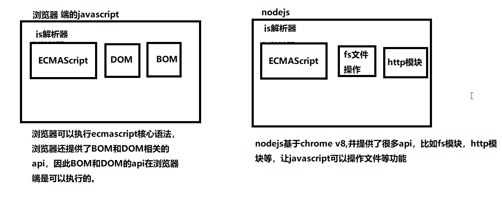

# 课程介绍

问题1：我们将来写的html页面存放在哪里？

问题2：我们写的页面的运行在哪里？


# node.js介绍

node.js，也叫作node，或者nodejs，指的都是一个东西。

## node.js 是什么？

> Node.js是一个Javascript运行环境(runtime environment)，发布于2009年5月，由Ryan Dahl开发，实质是对Chrome V8引擎进行了封装。Node.js对一些特殊用例进行优化，提供替代的API，使得V8在非浏览器环境下运行得更好。 

+ Node.js 是一个基于 Chrome V8 引擎的 JavaScript 运行环境。 

```
1. nodejs不是一门新的编程语言，nodejs是在服务端运行javascript的运行环境
2. javascript并不只是能运行在浏览器端，浏览器端能够运行js是因为浏览器有js解析器，因此只需要有js解析器，任何软件都可以运行js。
3. nodejs可以在服务端运行js，因为nodejs是基于chrome v8的js引擎。
```

+ Node.js 使用了一个事件驱动、非阻塞式 I/O 的模型，使其轻量又高效。  
+ Node.js 的包管理器 npm，是全球最大的开源库生态系统。 

## nodejs与浏览器端js的区别

nodejs是基于chrome v8引擎的，因此nodejs可以和浏览器一样执行js代码，但是二者执行的js还是有一定区别的。



思考：

1. 在浏览器端，可以使用javascript操作文件么？
2. 在nodejs端，可以使用BOM和DOM的方法么？
3. 我们学习nodejs，学习什么内容？

## 为什么要学习nodejs？

1. 通过学习Node.js开发深入理解**服务器开发**、**Web请求和响应过程**、 **了解服务器端如何与客户端配合**
2. 学习服务器端渲染网页
3. 学习服务器端为客户端编写接口
4. 现在前端工程师面试，对 Node.js 开发有要求

```javascript
//学习服务器端的知识，用php也可以啊，为什么还要学习nodejs
//1. nodejs使用的语言还是javascript，对于前端工程师来说更加容易使用
//2. nodejs在处理高并发上有得天独厚的优势。
//3. https://www.ibm.com/developerworks/cn/opensource/os-nodejs/
```

## nodejs可以干什么？

1. 开发命令行工具（CLI），比如npm,webpack,gulp等
2. 开发服务端程序
3. 开发桌面应用程序（借助 node-webkit、electron 等框架实现）

## nodejs学习资源

1. [node.js官方网站](https://nodejs.org/)
2. [node.js中文网](http://nodejs.cn/)
3. [node.js 中文社区](https://cnodejs.org/)

# nodejs的安装

## nodejs版本

下载地址

- [当前版本](https://nodejs.org/en/download/)
- [历史版本](https://nodejs.org/en/download/releases/)

官网术语解释

- LTS 版本：Long-term Support 版本，长期支持版，即稳定版。
- Current 版本：Latest Features 版本，最新版本，新特性会在该版本中最先加入。

查看node版本

```bash
node -v
```

## 环境变量

当要求系统运行一个**程序** 而没有告诉它程序所在的完整路径时，

1. 系统会在**当前目录** 下面寻找此程序
2. 如果没有找到，系统会在环境变量的所配置的目录中查找。


# 在nodejs上编写程序

## REPL介绍

1. REPL 全称: Read-Eval-Print-Loop（交互式解释器）
   - R 读取 - 读取用户输入，解析输入了Javascript 数据结构并存储在内存中。
   - E 执行 - 执行输入的数据结构
   - P 打印 - 输出结果
   - L 循环 - 循环操作以上步骤直到用户两次按下 ctrl-c 按钮退出。
2. 在REPL中编写程序 （类似于浏览器开发人员工具中的控制台功能）
   - 直接在控制台输入 `node` 命令进入 REPL 环境
3. 按两次 Control + C 退出REPL界面 或者 输入 `.exit` 退出 REPL 界面
   - 按住 control 键不要放开, 然后按两下 c 键

## 使用node执行js文件

【案例1：hello nodejs】

【案例2：打印直角三角形】


# global对象

JavaScript 中有一个特殊的对象，称为全局对象（Global Object），它及其所有属性都可以在程序的任何地方访问，即全局变量。

在浏览器 JavaScript 中，通常 window 是全局对象， 而 Node.js 中的全局对象是 `global`，所有全局变量（除了 global 本身以外）都是 global 对象的属性。

在 Node.js 我们可以直接访问到 global 的属性，而不需要在应用中包含它。

## setTimeout(cb, ms)

> **setTimeout(cb, ms)** 全局函数在指定的毫秒(ms)数后执行指定函数(cb)。：setTimeout() 只执行一次指定函数。
>
> 返回一个代表定时器的句柄值。

```javascript
function printHello(){
   console.log( "Hello, World!");
}
// 两秒后执行以上函数
setTimeout(printHello, 2000);
```

## clearTimeout(t)

> **clearTimeout( t )** 全局函数用于停止一个之前通过 setTimeout() 创建的定时器。 参数 **t** 是通过 setTimeout() 函数创建的定时器。 

```javascript
function printHello(){
   console.log( "Hello, World!");
}
// 两秒后执行以上函数
var t = setTimeout(printHello, 2000);

// 清除定时器
clearTimeout(t);
```

## setInterval(cb, ms)

## clearInterval(cb, ms)

## console

# fs模块
> fs模块是nodejs中最常用的一个模块，因此掌握fs模块非常的有必要，fs模块的方法非常多,用到了哪个查哪个即可。

