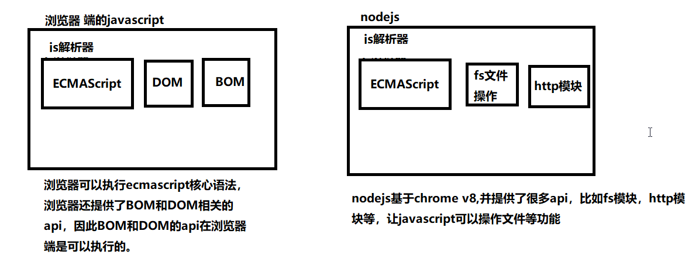

# 01-node介绍-浏览器与服务器交互流程

# 02-node介绍-为什么要学习nodejs？

> nodejs主要是服务端开发，前端工程师为什么要学习它？

+ nodejs是前端的基础设施

```javascript
1. 现在的前端项目基本上都是基于nodejs来进行构建的
2. 项目构建工具都是基于nodejs开发的。
```

+ 前端工程师需要具备一定的服务端开发能力

```javascript
 通过学习Node.js开发掌握以下能力：
	1. 理解服务器开发
    2. Web请求和响应过程
    3. 了解服务器端如何与客户端配合
    4. nodejs降低了学习成本，不用切换语言
```

+ 全栈工程师必经之路

```javascript
学习了js，可以做以下事情
	1. 浏览器端的页面
    2. 手机端的app开发
    3. 服务器端的开发
    4. pc桌面端的引用

说白了：学了js，啥都能干
```

+ 现在前端工程师面试，对 Node.js 开发有要求 

**学习nodejs，需要把浏览器端的思想转变到服务器端的思想，需要一个转变的过程**

# 03-node介绍-什么是nodejs

+  统一nodejs的说法， （nodejs  node.js  node）说的都是同一个东西
+ 介绍nodejs的网站
+ nodejs是javascript运行环境

```javascript
1. 解释运行环境：
	任何一门语言，都需要运行的环境
    php必须安装apache才能运行，java必须安装jvm才能运行
    javascript想要运行，必须要有javascript的运行时。  浏览器就是js的运行时
    nodejs就是js的运行时，说白了就是nodejs也能解析js
    
2. js是基于chrome v8，实质是对Chrome V8引擎进行了封装。Node.js对一些特殊用例进行优化，提供替代的API，使得V8在非浏览器环境下运行得更好。
```

+ Node.js 使用了一个事件驱动、非阻塞式 I/O 的模型，使其轻量又高效。  
+ Node.js 的包管理器 npm，是全球最大的开源库生态系统。 

+ nodejs端js与浏览器端js的区别

nodejs是基于chrome v8引擎的，因此nodejs可以和浏览器一样执行js代码，但是二者执行的js还是有一定区别的。



思考：

1. 在浏览器端，可以使用javascript操作文件么？
2. 在nodejs端，可以使用BOM和DOM的方法么？
3. 我们学习nodejs，学习什么内容？

# 04-nodejs介绍-安装

+ 根据操作系统选择不同的安装包
+ 双击安装，一直下一步即可。（**注意：不要安装在中文目录，推荐默认安装**）
+ 使用`node -v`查看nodejs版本
  + 注意：需要重新打开命令行窗口才会生效

# 05-nodejs介绍-环境变量


# 06-运行node程序-js文件

+ 书写js文件， helloNode.js
+ 通过node命令运行js文件
  + shift加右键打开命令窗口，执行 `node 文件名.js`即可
  + 给vscode安装`terminal`插件，直接在vscode中执行
+ 提示注意点：在`nodejs`中无法使用DOM对象，因此`window, document`等都是无法使用的

# 07-运行node程序-REPL

+ 在命令行窗口直接输入`node`可以进行REPL环境，与浏览器的`console控制台`差不多
+ 按两次 Control + C 退出REPL界面 或者 输入 `.exit` 退出 REPL 界面
+ REPL环境可以执行node代码，但是使用不多。

# 08-global模块-全局变量

+ 通过nodejs中无法使用document，但是能够使用`console.log`来引入node中的global模块
+ 讲解global模块中的console模块
+ 讲解global模块中的定时器的用法
+ 演示`__dirname`与`__filename`的作用

# 09-fs模块-读文件-基本使用

+ 讲解基本参数的使用

```javascript
/* 
  在nodejs中，提供了fs模块，这是node的核心模块
  注意：
    1. 除了global模块中的内容可以直接使用，其他模块都是需要加载的。
    2. fs模块不是全局的，不能直接使用。因此需要导入才能使用。
*/

//1. 导入fs模块
var fs = require("fs");

//2. 调用fs的读文件方法
//参数1： 文件的名字
//参数2： 读取文件的回调函数
  //参数1：错误对象，如果读取失败，err会包含错误信息，如果读取成功，err是null
  //参数2：读取成功后的数据（是一个Buffer对象）
fs.readFile("data.txt", function(err, data){
  console.log(err);
  console.log(data);
});
```

+ 讲解buffer的问题

```javascript
1. Buffer对象是Nodejs用于处理二进制数据的。
2. 其实任意的数据在计算机底层都是二进制数据，因为计算机只认识二进制。
3. 所以读取任意的文件，返回的结果都是二进制数据，即Buffer对象
4. Buffer对象可以调用toString()方法转换成字符串。
```

# 10-fs模块-读文件-进阶内容

+ 查看fs的官方文档
+ fs模块可以设置编码的参数

```javascript
//参数1： 文件的路径
//参数2： 编码，如果设置了，返回一个字符串，如果没有设置，会返回一个buffer对象
//参数3： 回调函数
fs.readFile("data.txt", "utf8",function(err, data){
  console.log(err);
  console.log(data);
});
```

+ 读取一个文本文件，可以有两种方式

```javascript
1. 指定编码
2. 不指定编码，通过toString()方法转换成字符串
```

+ 错误处理的写法

```javascript
fs.readFile("data.txt", "utf8",function(err, data){
  if(err) {
    return console.log("读取文件失败了,错误信息是",err);
  }
  console.log(data);
});
```

# 11-fs模块-写文件-基本使用

+ 写文件的基本使用

```javascript
var fs = require("fs");

//写文件
//参数1：写入的文件名(如果文件不存在，会自动创建)
//参数2：写入的文件内容（注意：写入的内容会覆盖以前的内容）
fs.writeFile("2.txt", "hello world, 我是一个中国人", function(err){
  if(err) {
    return console.log("写入文件失败", err);
  }
  console.log("写入文件成功");
});
```

+ 如果不想覆盖之前的内容，需要使用appendFile

```javascript
var fs = require("fs");

fs.appendFile("2.txt", "我是追加的内容", function(err){
  if(err) {
    return console.log("追加文件内容失败");
  }
  console.log("追加文件内容成功");
})
```

# 12-fs模块-写文件-追加内容

练习-如果不使用appendFile,通过readFile与writeFile能否失败内容的追加

```javascript
var fs = require("fs");

fs.readFile("2.txt", "utf8", function(err, data){
  if(err) {
    console.log("读取文件内容失败");
    return;
  }

  fs.writeFile("2.txt", data + "需要追加的内容", function(err){
    if(err) {
      console.log("写入内容失败");
      return;
    }

    console.log("追加内容成功");
  })
});
```

# 13-fs模块-同步方法说明

+ nodejs中所有的文件操作，都提供了异步和同步两种方式

```javascript
//异步方式
var fs = require("fs");

console.log(111);
fs.readFile("2.txt", "utf8", function(err, data){
  if(err) {
    return console.log("读取文件失败", err);
  }
  console.log(data);
});
console.log("222");
//同步方式
var result = fs.readFileSync("2.txt", "utf-8");
console.log(result);
```

+ 追加内容的同步写法

```javascript
var result = fs.readFileSync("2.txt", "utf-8");
fs.writeFileSync("2.txt", result + "需要追加的内容");
console.log("写入成功了");
```

+ 注意：同步操作会影响性能，因此尽量使用异步方法，尤其是在工作过程中。

# 14-path模块-路径操作的问题

+ 演示相对路径的问题

```javascript
var fs = require("fs");

//读取文件内容
//data.txt是相对路径，读取当前目录下的data.txt
//相对路径相对的是指向node命令的路径
//报错了， 在当前执行node命令的目录下查找data.txt，找不到
fs.readFile("data.txt", "utf8", function(err, data) {
  if(err) {
    console.log("读取文件失败", err);
  }

  console.log(data);
});
```

+ 引入绝对路径

```javascript
__dirname: 当前文件的目录
__filename: 当前文件的文件名
（当前文件：）：__dirname写在哪个文件中，当前文件就是哪个文件

var fs = require("fs");

//读取文件内容
//data.txt是相对路径，读取当前目录下的data.txt
//相对路径相对的是指向node命令的路径
//报错了， 在当前执行node命令的目录下查找data.txt，找不到
console.log(__dirname);
console.log(__filename);
fs.readFile(__dirname + "\\data.txt", "utf8", function(err, data) {
  if(err) {
    console.log("读取文件失败", err);
  }
  console.log(data);
});
```

# 15-path模块-解决路径拼接问题

+ 在linux系统中，路径分隔符使用的是`/`，但是在windows系统中，路径使用的`\`
+ 所以在刚刚的拼串中，其实是有问题的，在linux操作系统下，会没有效果
+ 介绍path.join()方法

```javascript
path.join();//拼接路径

//windows系统下
> path.join("abc","def","gg", "index.html")
"abc\def\gg\a.html"

//linux系统下
> path.join("abc","def","gg", "index.html")
'abc/def/gg/index.html'
```

+ 介绍其他的几个方法

```javascript
path.basename(path[, ext])	返回文件的最后一部分
path.dirname(path)	返回路径的目录名
path.extname(path)	获取路径的扩展名

var path = require("path");
var temp = "abc\\def\\gg\\a.html";
console.log(path.basename(temp));//a.html
console.log(path.dirname(temp));//abc\def\gg
console.log(path.extname(temp));//.html
```

+ 优化读取文件的写法

```javascript
var fs = require("fs");
var path = require("path");

//data.txt是一个相对路径，需要使用绝对路径

fs.readFile(path.join(__dirname, "data.txt"), "utf-8", function(err, data){
  if(err) {
    return console.log("读取文件失败", err);
  }
  console.log(data);
})
```

# 16-http模块-创建http服务器

+ 当我们安装完了phpStudy之后，就有了一个apache服务器，默认会监听80端口，但是安装完nodejs之后，并且没有服务器，服务器需要我们自己创建
+ 讲解http模块的基本使用

```javascript
//1. 导入http模块，http模块是node的核心模块，作用是用来创建http服务器的。
var http = require("http");

//2. 创建服务器
var server = http.createServer();

//3. 服务器处理请求
// 给服务器注册了 request 事件 （网络请求的事件）
// 只要接收到了请求， function就会执行
server.on("request", function() {
  console.log("我接收到请求了");
});

//4. 启动服务器，监听某个端口
//参数1：端口号  范围0-65535 但是我们不要使用3000以下的端口
// 因为3000以下的端口一般都是给系统使用的。
//参数2：回调函数
server.listen(9999, function(){
  console.log("服务器启动成功了, 请访问： http://localhost:9999");
});
```

+ 解释不同的地方

```javascript
服务器启动之后，会一直运行，因为要一直监听用户的请求
```

+ 处理请求和响应

```javascript
//function有两个参数，
  // request是请求对象，可以获取到所有的请求信息 
  // response是响应对象，可以给用户响应
server.on("request", function(req, res) {
  //给服务器响应
  
  res.write("hello world");
  //响应完成，一定需要结束
  res.end();
});
```

+ 解决中文乱码问题

```javascript
//解决中文乱码的问题
res.setHeader("content-type", "text/html;charset=utf-8");
```

# 17-http模块-request对象常用属性

+ 教同学查找文件：http://nodejs.cn/api/http.html#http_message_headers
+ 讲解常用属性中的headers

```javascript
{ 
  host: 'localhost:9999',
  connection: 'keep-alive',
  'cache-control': 'max-age=0',
  'upgrade-insecure-requests': '1',
  'user-agent':
   'Mozilla/5.0 (Windows NT 10.0; Win64; x64) AppleWebKit/537.36 (KHTML, like Gecko) Chrome/66.0.3359.117 Safari/537.36',
  accept:
   'text/html,application/xhtml+xml,application/xml;q=0.9,image/webp,image/apng,*/*;q=0.8',
  'accept-encoding': 'gzip, deflate, br',
  'accept-language': 'zh-CN,zh;q=0.9,en;q=0.8',
  cookie: '_ga=GA1.1.1947752795.1529984123' 
}
```

+ 解释两次请求的问题

```
谷歌浏览器每次发请求的时候，会自动带上 favicon.ico的一个请求。
```

+ 讲解method属性

```javascript
请求的方式： get或者post
```

+ 讲解rawHeaders

```javascript
数组的形式打印所有的请求头
```

+ 讲解url属性

```javascript
获取请求的url地址
```

+ 小结

```javascript
request对象中，其实最常用的就两个
method 和 url 
```

# 18-http模块-response对象常用的属性

+ 找文档：http://nodejs.cn/api/http.html#http_class_http_serverresponse
+ 讲解write方法：

```javascript
//该方法会发送一块响应主体。 它可被多次调用，以便提供连续的响应主体片段。
res.write("hello1");
res.write("hello2");
```

+ 讲解end方法：

```javascript
该方法会通知服务器，所有响应头和响应主体都已被发送，即服务器将其视为已完成。 每次响应都必须调用 response.end() 方法。

如果指定了 data，则相当于调用 response.write(data, encoding) 之后再调用 response.end(callback)。
res.end("哈哈");
```

+ 讲解：statusCode和statusMessage

```javascript
一般只需要设置statusCode即可。statusMessage会自动变
```

+ 讲解setHeader()设置响应头
+ 讲解writeHead()设置响应头
+ 讲解注意点：必须先设置响应头，才能设置响应体

# 19-http模块-根据不同请求，响应不同的内容

# 20-http模块-根据不同请求，响应不同的html文件

# 21-http模块-模拟apache

apache的功能：在浏览器中访问具体的文件，找到对应的文件进行响应，如果没有这个文件，提示找不到。

我们需要给每一个文件都设置上content-type,告诉浏览器该怎么解析这个文件

# 22-http模块-使用mime包解决请求头的问题


